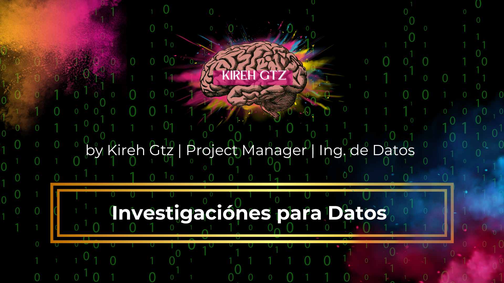
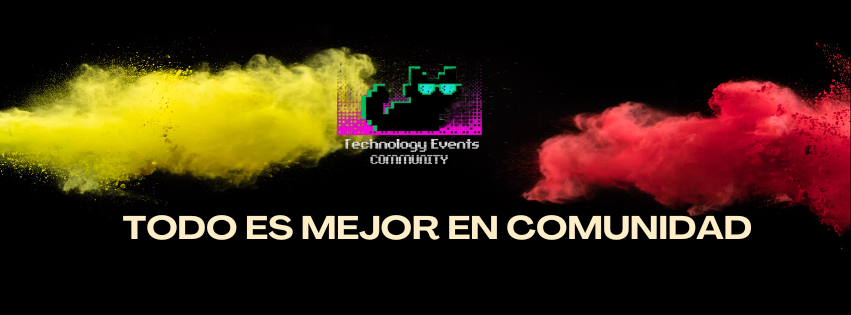
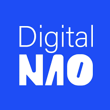
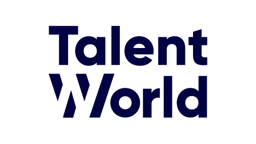
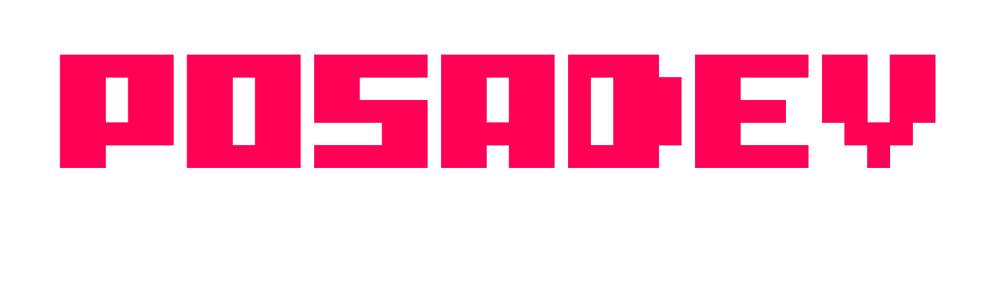

# Hola mi nombre es 🅼🅰🆁🅸🅴🅻 👋

  

## Freelance Project Manager, Marketing e Ing.de Datos 

He sido speaker compartiendo mi conocimiento en data y otras areas de tecnología en espacios como: 

**Universidad Anáhuac,AZ Founders, Talent Network, Universidad de Tepic e 
IT Girls de Density Labs.**

Mi compromiso con el desarrollo profesional me llevo a ser mentora en Recursos Humanos para 
Laboratoria y Team Leader Ambassador de Hack a Boss como Networker y Scrum Master en 
la asociación civil [ALMA LACTANCIA](https://alma-lactancia-web3.vercel.app/)
gracias a mi desempeño como team leader Ambassador colaboro con 
[HACK A BOSS](https://www.hackaboss.com/) una de las Startup mejor posicionada en España 

## Technology Events Community

  

 

He creado la comunidad [Technology Events Community](https://technologyeventscommunity.wordpress.com/), 
en donde se fomenta el crecimiento profesional, inclusión de la mujer y la colaboración continua de 
proyectos en el mundo tecnológico, te ayudamos a conectar con otras comunidades, de las cuales cuentan con diferentes recursos que ayudan a las personas en apoyo de transformación digital y tecnologías de diferentes areas. 

[Unete aquí](https://t.me/+IK-2Of-y7tphN2Ix)

  
  
   
   

<!--
**Marielgtz/Marielgtz** is a ✨ _special_ ✨ repository because its `README.md` (this file) appears on your GitHub profile.

Here are some ideas to get you started:

- 🔭 I’m currently working on ...
- 🌱 I’m currently learning ...
- 👯 I’m looking to collaborate on ...
- 🤔 I’m looking for help with ...
- 💬 Ask me about ...
- 📫 How to reach me: ...
- 😄 Pronouns: ...
- ⚡ Fun fact: ...
-->
